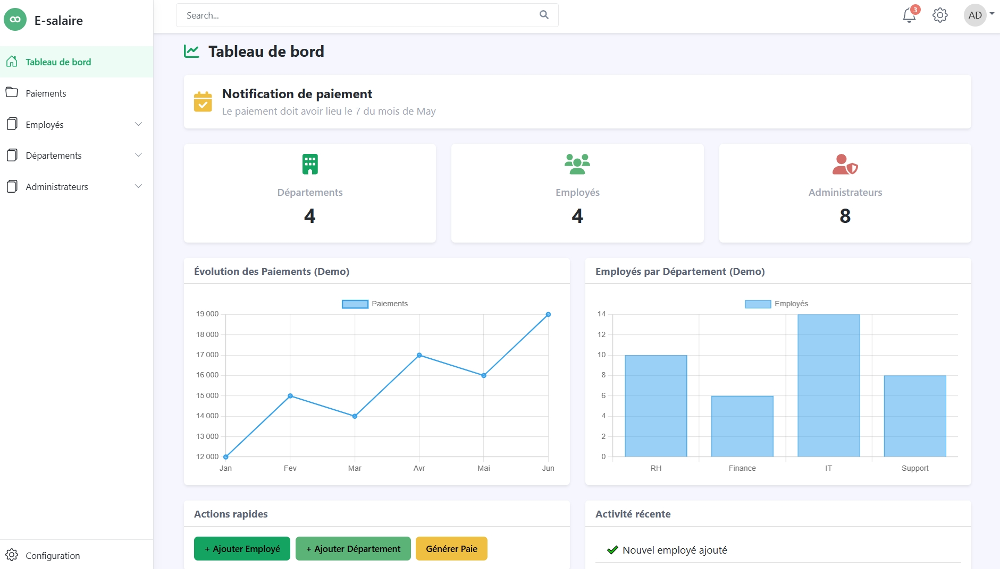
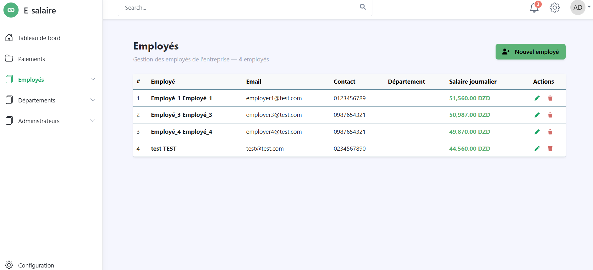
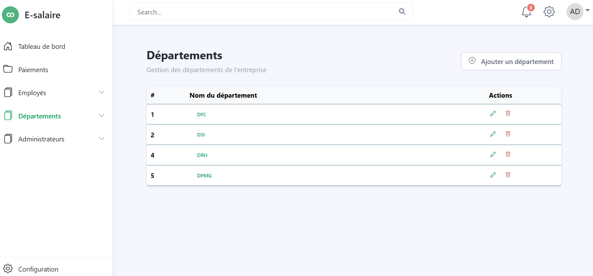
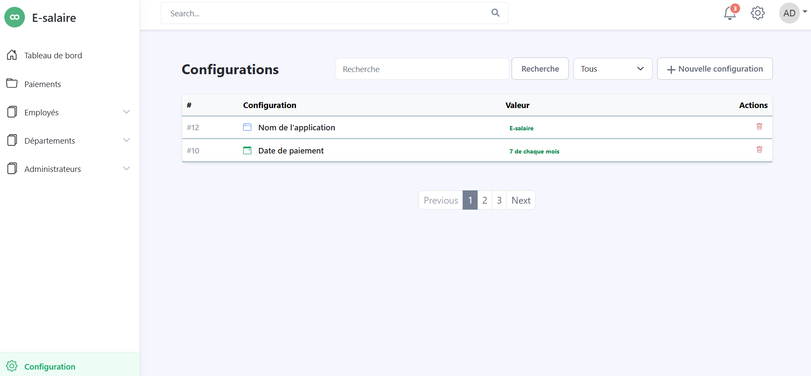

# 💼 Salary Management System

A modern **Human Resources & Salary Management** web application built with **Laravel**.

This project helps companies manage employees, departments, administrators, and salary configurations through a clean and centralized dashboard.

---

## 🚀 Features

✅ Employee management  
✅ Department management  
✅ Administrator management  
✅ Salary configuration system  
✅ Secure authentication system  
✅ Clean enterprise dashboard UI  
✅ CRUD operations with confirmation modals  
✅ Responsive interface  

---

## 🖥️ Application Screenshots

### 🔐 Login Page


---

### 📊 Dashboard


---

### 👥 Employees Management


---

### 🏢 Departments


---

### ⚙️ Configurations


---

## 🛠️ Tech Stack

- **Backend:** Laravel
- **Frontend:** Blade + Bootstrap
- **Database:** MySQL
- **Authentication:** Laravel Auth
- **Icons:** Bootstrap Icons / FontAwesome

---

## ⚙️ Installation

### 1️⃣ Clone repository

```bash
git clone https://github.com/YOUR_USERNAME/salary-management.git
